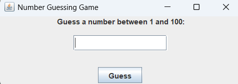
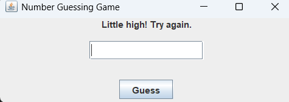
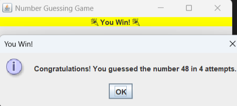

# Java Projects

1. Attendence Management System

2. Brick Breaker Game

3. Currency Converter App 

4. Library Management System

5. Number Guessing Game

6. Online Voting System

7. Simple Banking Application

8. TodoList Application

______________________________________________________________________________________________________________________________________________________________________________________________________________________________________________________________________________________________________

# 1. Attendence Management System

## Overview

A simple Java Swing-based Attendance Management System with a clean and modern user interface. It allows users to add attendance records for students and view the recorded attendance in a tabular format.

## 🖥️ Screenshots


## Features

  - User-friendly GUI with buttons located on the top for easy navigation

  - Add student attendance with input validation

  - View attendance records in a sortable table with attendance percentage calculation

  - Responsive UI using CardLayout to switch between Add Attendance and View Records panels

## Getting Started
### Prerequisites

  - Java Development Kit (JDK) 8 or above

  - An IDE like IntelliJ IDEA, Eclipse, or use of command-line tools

### Installation

  1. Clone or download the project from the repository.

  2. Navigate to the project directory.

### Running the Project

Compile and run from the command line within the project directory:

```bash
javac AttendanceManagementSystem/AttendanceManagementSystem.java
```
```bash
java AttendanceManagementSystem.AttendanceManagementSystem
```

## Usage

  - Click Add Attendance button on top to switch to the input form.

  - Enter Student Name, Total Classes Held, and Classes Attended.

  - Click Add Record to save the data.

  - Click View Records to see the attendance list with calculated percentage.

## Future Enhancements

  - Persistence support with a database (MySQL, SQLite)

  - Export attendance reports to CSV or PDF

  - User authentication and role management

  - Enhanced UI/UX with themes and animations


______________________________________________________________________________________________________________________________________________________________________________________________________________________________________________________________________________________________________
# 2. Brick Breaker Game

A classic Brick Breaker arcade game implemented in Java Swing with a modern and stylish user interface.

## Project Overview

This project is a fun and interactive 2D game where the player controls a paddle to bounce a ball and break bricks arranged in rows. The game tracks scores, supports winning and game-over scenarios, and allows restarting the game using the keyboard.

The UI features smooth animation with Java's Swing Timer, colorful bricks and ball, and clear score display.

## 🖥️ Screenshots


## Features

  - Paddle controlled by left and right arrow keys.

  - Ball bounces off paddle, walls, and bricks.

  - Bricks break upon ball collision and increase score.

  - Game over and winning screen with restart prompt.

  - Modern UI colors and fonts using Java AWT and Swing.

  - Simple and easy-to-understand Java code suitable for learning game programming basics.

## Technologies Used

  - Java (version 8 or above recommended)

  - Java Swing for GUI rendering

  - AWT for event handling and 2D drawing

## How to Run

  1. Ensure JDK is installed and javac and java commands are accessible.

  2. The source files should be placed inside the folder named BrickBreakerGame (matching the package name).

  3. From the parent directory of BrickBreakerGame, compile:

```bash
javac BrickBreakerGame/BrickBreakerGame.java
```

  4. Run the game:

```bash
java BrickBreakerGame.BrickBreakerGame
```

  5. Use left/right arrow keys to move the paddle. Press Enter to start or restart the game.

## Controls

  - Left Arrow: Move paddle left

  - Right Arrow: Move paddle right

  - Enter: Start or restart the game after game over or winning

______________________________________________________________________________________________________________________________________________________________________________________________________________________________________________________________________________________________________

# 3. Currency Converter Java Application

## Overview
This is a simple Java Swing-based graphical application that converts currency amounts between multiple currencies. It provides a clean and user-friendly interface to select source and target currencies, enter an amount, and get the converted result.

## 🖥️ Screenshots


## Features
- Supports multiple currencies with predefined exchange rates.
- Easy-to-use interface with dropdowns for currency selection and input field for amount.
- Displays converted amount with 2 decimal precision.
- Error handling for invalid amount inputs.

## Technologies Used
- Java SE (Standard Edition)
- Swing library for GUI components

## Getting Started

### Prerequisites
- Java Development Kit (JDK) 11 or higher installed
- Any Java IDE or a text editor with command-line tools

### Running the Application
1. Clone or download the repository.
2. Open a terminal in the project directory.
3. Compile the source code:
```bash
javac CurrencyConverterApp.java
```

4. Run the compiled program:
```bash
java CurrencyConverterApp
```

5. The Currency Converter window will open. Select currencies, enter an amount and click "Convert".

## Usage
- Select the currency you want to convert from using the "From Currency" dropdown.
- Select the currency you want to convert to using the "To Currency" dropdown.
- Enter the amount you want to convert.
- Click the "Convert" button.
- The converted amount will be displayed below.

## Project Structure
- `CurrencyConverterApp.java`: Main application file containing the UI and logic.

## Future Enhancements
- Fetch real-time currency exchange rates from an API.
- Add more currencies.
- Export conversion results.
- Improve UI styling.


___________________________________________________________________________________________________________________________________________________
___________________________________________________________________________________________________________________________________________________


# 4. 📚 Library Management System (Java Swing)
A modern, user-friendly Library Management System built with Java Swing.
Easily manage books, members, and transactions with a beautiful graphical interface.

## ✨ Features
Login & Signup: Secure authentication for multiple users.

Books: Add, remove, and view all books.

Members: Register and manage library members.

Transactions: Issue and return books, with automatic fine calculation.

Modern UI: Clean design, intuitive navigation, and responsive tables.

## 🚀 Getting Started
1. Clone or Download:
```bash
git clone https://github.com/Sasank-5716/Java_projects
```

2. Compile
```bash
javac LibraryManagementSystem/libraryManagementSystem.java
```

3. Run
```bash
java LibraryManagementSystem/libraryManagementSystem

```

4. Login or Signup:

-Default admin:

    -Username: admin

    -Password: admin

-Or create a new account via Signup.

## 🖥️ Screenshots


Happy reading and managing! 📖✨


___________________________________________________________________________________________________________________________________________________
___________________________________________________________________________________________________________________________________________________


# 5. Number Guessing Game (Java Swing)
A simple and interactive Number Guessing Game built with Java Swing. The game challenges players to guess a randomly generated number between 1 and 100, providing helpful feedback and a celebratory animation when the correct number is guessed.

## Features
- Intuitive GUI using Java Swing.

- Feedback on guesses:

    - "Too high" / "Too low"

    - "Little high" / "Little low" (if within 5 of the target)

- Keyboard shortcuts: Press Enter to submit a guess.

- Winner animation: Colorful flashing and celebratory text when the correct number is guessed.

- Input validation: Ensures only numbers between 1 and 100 are accepted.

## Screenshots






## Getting Started
### Prerequisites
Java Development Kit (JDK) 8 or above installed

A text editor or IDE (e.g., IntelliJ IDEA, Eclipse, VS Code)

### Installation and Running
1. Clone or Download the Repository

    - Download the source code or clone the repository to your local machine.

2. Compile the Program

```bash
javac NumberGuessingGame/NumberGuessingGame.java
```
3. Run the Program

```bash
java NumberGuessingGame/NumberGuessingGame
```

## How to Play
1. Start the game: The window displays a prompt to guess a number between 1 and 100.

2. Enter your guess in the text field and click "Guess" or press Enter.

3. Read the feedback:

    - If your guess is too high/low, or just a little high/low, feedback is shown above the input.

    - If you guess correctly, a celebratory animation plays and a congratulatory message appears.

4. Play again: After winning, the game resets automatically for a new round.

## Customization
- Change the range: Adjust the random number range in the code.

- Modify animations: Customize colors, duration, or add images/sounds.

- Enhance UI: Add more styling or features as desired.


______________________________________________________________________________________________________________________________________________________________________________________________________________________________________________________________________________________________________

# 6. Online Voting System


___________________________________________________________________________________________________________________________________________________
___________________________________________________________________________________________________________________________________________________

# 7. 🏦 Simple Banking Application (Java)
A straightforward Java application to manage basic banking operations such as account creation, deposits, withdrawals, and balance checks—all via a user-friendly interface.

## ✨ Features
Account Management: Create and manage multiple bank accounts.

Deposit & Withdraw: Securely deposit or withdraw funds.

Balance Inquiry: Instantly check account balances.

Transaction History: View recent transactions for each account.

Simple UI: Clean, intuitive Java Swing interface for easy navigation.

## 🚀 Getting Started
1. Clone Repo
```bash
git clone https://github.com/Sasank-5716/Java_projects
```
2. Compile
```bash
javac SimpleBankingApplication/SimpleBankingApplication.java

```

3. Run the program
```bash
java SimpleBankingApplication/SimpleBankingApplication
```


## 📝 Usage
1. Create Account:
Enter user details and open a new bank account.

2. Deposit/Withdraw:
Select an account, specify the amount, and perform the transaction.

3. Check Balance:
Instantly view the current balance of any account.

4. View Transactions:
See a list of recent deposits and withdrawals for each account.

## 🖥️ Screenshots


Enjoy safe and simple banking! 💸

______________________________________________________________________________________________________________________________________________________________________________________________________________________________________________________________________________________________________

# 8. TodoList Application 📝✨ 

A visually appealing **Java Swing To-Do List application** that allows users to add, view, mark as completed, and remove tasks — all with a splash of fun emojis! Tasks are separated into **Pending** and **Completed** sections. This app showcases the use of Java collections, custom renderers, Swing components, and an intuitive graphic user interface.

## 🚀 Features

- **Add Tasks** ➕: Input a task in the text field and press **Add Task** or hit Enter.
- **View Tasks** 👀: See your *Pending* and *Completed* tasks, separated for clarity.
- **Mark as Completed** ✅: Click the checkbox next to a Pending task to move it to Completed.
- **Restore to Pending** 🔁: Uncheck a Completed task to put it back into Pending.
- **Remove Tasks** 🗑️: Select any task and click its **Remove Selected** button or press Delete.
- **Friendly UI** 🎨: Clean interface with accessible colors, black text, and playful emoji labels for an uplifting experience.

## Screenshot


## 🛠️ How to Get Started

### Prerequisites

- Java 8 or higher ☕
- IDE such as IntelliJ IDEA, Eclipse, NetBeans or terminal access to javac and java

### Installation & Running

1. **Clone or Download** this repository 📥
```bash
git clone https://github.com/Sasank-5716/Java_projects
```

2. **Navigate** to your project directory 📂
```bash
cd TodoListApp
```

3. **Compile:**
```bash
javac TodoListApp.java
```
4. **Run:**
```bash
java TodoListApp
```

## 🗂️ Code Structure

- **TodoListApp.java**  
  This file contains:
  - The full GUI setup built with Java Swing
  - The custom `Task` class storing your task info
  - A custom renderer displaying checkboxes with emojis
  - Logic to seamlessly organize pending and completed sections

## 💡 Usage Guide

- **Adding a Task** ➕  
  Enter your task and press `Add Task` or hit Enter.
- **Mark as Completed** ✅  
  Click the checkbox next to any Pending task; it jumps to the Completed section!
- **Restore to Pending** 🔄  
  Uncheck a task in the Completed list to send it back to Pending.
- **Deleting a Task** 🗑️  
  Select and click `Remove Selected` **or** press Delete on your keyboard.


