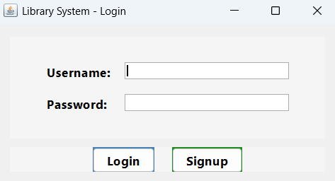

# Java Projects

1- Simple Banking Application
2- Library Management System


___________________________________________________________________________________________________________________________________________________


# 📚 Library Management System (Java Swing)
A modern, user-friendly Library Management System built with Java Swing.
Easily manage books, members, and transactions with a beautiful graphical interface.

## ✨ Features
Login & Signup: Secure authentication for multiple users.

Books: Add, remove, and view all books.

Members: Register and manage library members.

Transactions: Issue and return books, with automatic fine calculation.

Modern UI: Clean design, intuitive navigation, and responsive tables.

## 🚀 Getting Started
1. Clone or Download:
```bash
git clone https://github.com/Sasank-5716/Java_projects
```

2. Compile
```bash
javac libraryManagementSystem.java
```

3. Run
```bash
java libraryManagementSystem

```

4. Login or Signup:

-Default admin:

    -Username: admin

    -Password: admin

-Or create a new account via Signup.

## 🖥️ Screenshots




Happy reading and managing! 📖✨