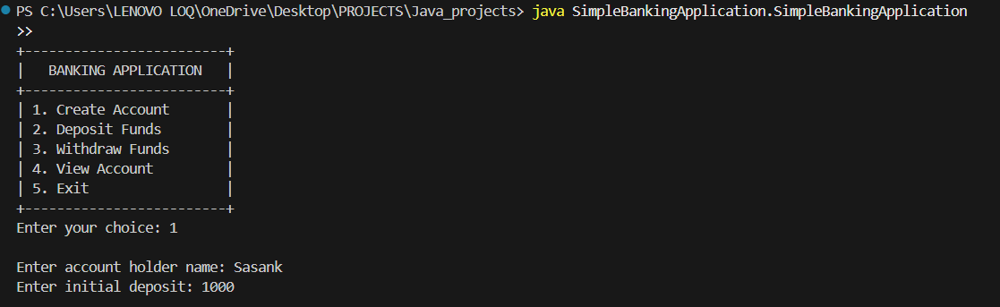
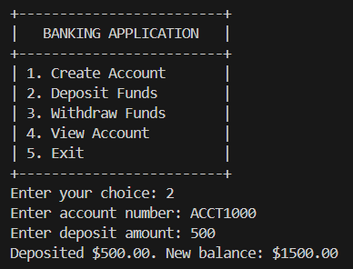
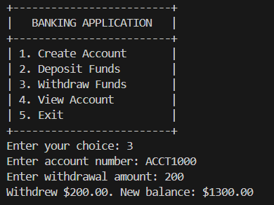
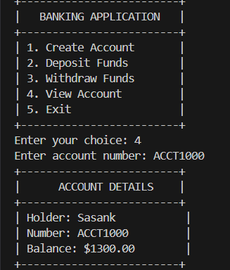
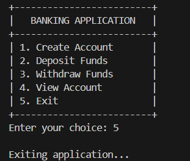

# Java Projects

1. Library Management System

2. Simple Banking Application

3. Number Guessing Game


___________________________________________________________________________________________________________________________________________________


# 1. 📚 Library Management System (Java Swing)
A modern, user-friendly Library Management System built with Java Swing.
Easily manage books, members, and transactions with a beautiful graphical interface.

## ✨ Features
Login & Signup: Secure authentication for multiple users.

Books: Add, remove, and view all books.

Members: Register and manage library members.

Transactions: Issue and return books, with automatic fine calculation.

Modern UI: Clean design, intuitive navigation, and responsive tables.

## 🚀 Getting Started
1. Clone or Download:
```bash
git clone https://github.com/Sasank-5716/Java_projects
```

2. Compile
```bash
javac LibraryManagementSystem/ibraryManagementSystem.java
```

3. Run
```bash
java LibraryManagementSystem/ibraryManagementSystem

```

4. Login or Signup:

-Default admin:

    -Username: admin

    -Password: admin

-Or create a new account via Signup.

## 🖥️ Screenshots


Happy reading and managing! 📖✨

___________________________________________________________________________________________________________________________________________________

# 2. 🏦 Simple Banking Application (Java)
A straightforward Java application to manage basic banking operations such as account creation, deposits, withdrawals, and balance checks—all via a user-friendly interface.

## ✨ Features
Account Management: Create and manage multiple bank accounts.

Deposit & Withdraw: Securely deposit or withdraw funds.

Balance Inquiry: Instantly check account balances.

Transaction History: View recent transactions for each account.

Simple UI: Clean, intuitive Java Swing interface for easy navigation.

## 🚀 Getting Started
1. Clone Repo
```bash
git clone https://github.com/Sasank-5716/Java_projects
```
2. Compile
```bash
javac SimpleBankingApplication/SimpleBankingApplication.java

```

3. Run the program
```bash
java SimpleBankingApplication/SimpleBankingApplication
```


## 📝 Usage
1. Create Account:
Enter user details and open a new bank account.

2. Deposit/Withdraw:
Select an account, specify the amount, and perform the transaction.

3. Check Balance:
Instantly view the current balance of any account.

4. View Transactions:
See a list of recent deposits and withdrawals for each account.

## 🖥️ Screenshots











Enjoy safe and simple banking! 💸


_________________________________________________________________________________________________________________________________________________________________________


# Number Guessing Game (Java Swing)
A simple and interactive Number Guessing Game built with Java Swing. The game challenges players to guess a randomly generated number between 1 and 100, providing helpful feedback and a celebratory animation when the correct number is guessed.

## Features
- Intuitive GUI using Java Swing.

- Feedback on guesses:

    - "Too high" / "Too low"

    - "Little high" / "Little low" (if within 5 of the target)

- Keyboard shortcuts: Press Enter to submit a guess.

- Winner animation: Colorful flashing and celebratory text when the correct number is guessed.

- Input validation: Ensures only numbers between 1 and 100 are accepted.

## Screenshots
Add screenshots of the game window here for better visualization.

## Getting Started
### Prerequisites
Java Development Kit (JDK) 8 or above installed

A text editor or IDE (e.g., IntelliJ IDEA, Eclipse, VS Code)

### Installation and Running
Clone or Download the Repository

Download the source code or clone the repository to your local machine.

Compile the Program

bash
javac NumberGuessingGameGUI.java
Run the Program

bash
java NumberGuessingGameGUI

## How to Play
Start the game: The window displays a prompt to guess a number between 1 and 100.

Enter your guess in the text field and click "Guess" or press Enter.

Read the feedback:

If your guess is too high/low, or just a little high/low, feedback is shown above the input.

If you guess correctly, a celebratory animation plays and a congratulatory message appears.

Play again: After winning, the game resets automatically for a new round.

## Customization
Change the range: Adjust the random number range in the code.

Modify animations: Customize colors, duration, or add images/sounds.

Enhance UI: Add more styling or features as desired.

Credits
Developed as a beginner-friendly Java Swing project for learning and fun.

