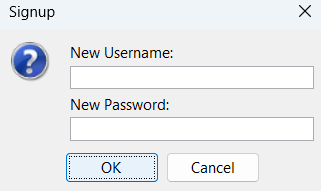

# Java Projects

1. Library Management System

2. Simple Banking Application


___________________________________________________________________________________________________________________________________________________


# 1. 📚 Library Management System (Java Swing)
A modern, user-friendly Library Management System built with Java Swing.
Easily manage books, members, and transactions with a beautiful graphical interface.

## ✨ Features
Login & Signup: Secure authentication for multiple users.

Books: Add, remove, and view all books.

Members: Register and manage library members.

Transactions: Issue and return books, with automatic fine calculation.

Modern UI: Clean design, intuitive navigation, and responsive tables.

## 🚀 Getting Started
1. Clone or Download:
```bash
git clone https://github.com/Sasank-5716/Java_projects
```

2. Compile
```bash
javac libraryManagementSystem.java
```

3. Run
```bash
java libraryManagementSystem

```

4. Login or Signup:

-Default admin:

    -Username: admin

    -Password: admin

-Or create a new account via Signup.

## 🖥️ Screenshots



Happy reading and managing! 📖✨

___________________________________________________________________________________________________________________________________________________

# 2. 🏦 Simple Banking Application (Java)
A straightforward Java application to manage basic banking operations such as account creation, deposits, withdrawals, and balance checks—all via a user-friendly interface.

## ✨ Features
Account Management: Create and manage multiple bank accounts.

Deposit & Withdraw: Securely deposit or withdraw funds.

Balance Inquiry: Instantly check account balances.

Transaction History: View recent transactions for each account.

Simple UI: Clean, intuitive Java Swing interface for easy navigation.


## 📝 Usage
1. Create Account:
Enter user details and open a new bank account.

2. Deposit/Withdraw:
Select an account, specify the amount, and perform the transaction.

3. Check Balance:
Instantly view the current balance of any account.

4. View Transactions:
See a list of recent deposits and withdrawals for each account.

## 🖥️ Screenshots


Enjoy safe and simple banking! 💸

